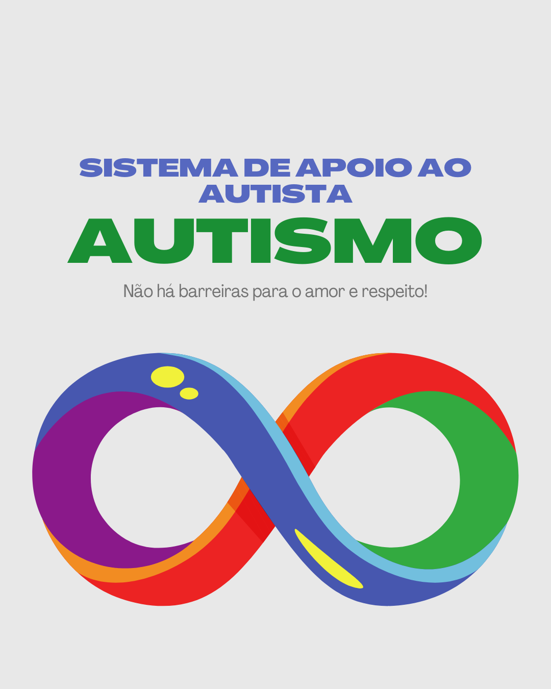

# Sistema Avaliação de Autismo em Adultos

Sistema criado para usar resultados de testes AQ Score Spectrum e outras informações do paciente para prever se o mesmo se enquadra no espectro autista ou não.

### 📋 Pré-requisitos

- Possuir um navegador

## ⚙️ Executando os testes

Para testar o sistema em seu navegador, você precisará baixar o repositório do Github chamado mvp-qualidade-seguranca-sistemas-inteligentes, no link: https://github.com/robertsonazevedo/mvp-qualidade-seguranca-sistemas-inteligentes
Após baixar, basta ir na pasta front, localizar o arquivo index.html e abrir em seu navegador.

### 📋 Melhorias Futuras

- Incluir mais informações psicossociais relevantes à avaliação.

## 🛠️ Construído com

* [HTML](https://developer.mozilla.org/en-US/docs/Web/HTML) - Markup Language para desenvolver os elementos da página.
* [CSS](https://developer.mozilla.org/en-US/docs/Web/CSS) - Usado para estilização do projeto.
* [Javascript](https://devdocs.io/javascript/) - Linguragem de programação usada no Frontend.

## 📌 Versão

Nós usamos [SemVer](http://semver.org/) para controle de versão. Para as versões disponíveis, observe as [tags neste repositório](https://github.com/suas/tags/do/projeto). 

## ✒️ Autores

* **Robertson Azevedo** - *Trabalho Inicial e Documentação* - [robertsonazevedo](https://github.com/robertsonazevedo)
E-mail: azevedo.robertson@gmail.com / contato@techrobertson.com

## 📄 Licença

Este projeto está sob a licença (sua licença) - veja o arquivo [LICENSE.md](https://github.com/usuario/projeto/licenca) para detalhes.

## 🎁 Expressões de gratidão

* Agradecimento ao meu filho Noah, por me inspirar a seguir em frente 📢;

---
⌨️ com ❤️ por [Robertson Azevedo](https://github.com/robertsonazevedo) 😊